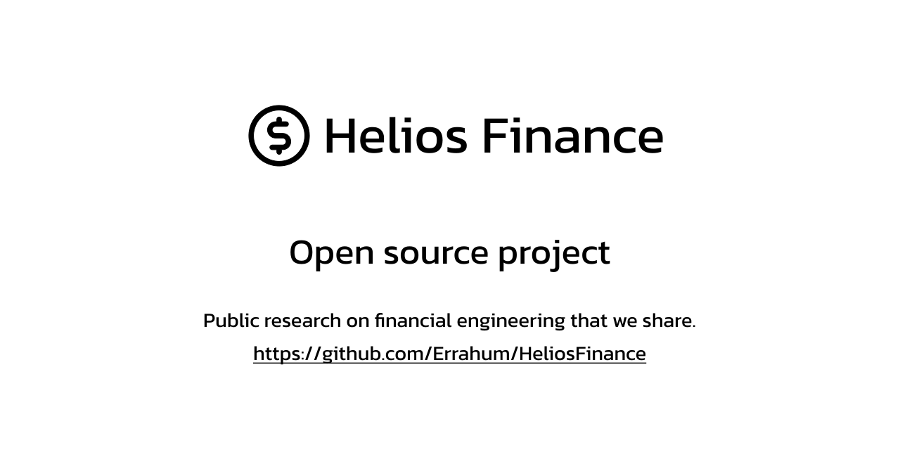
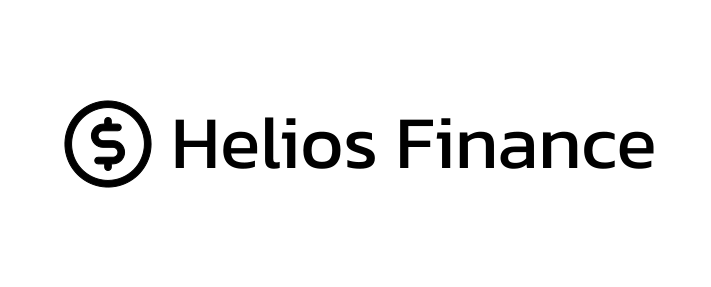

# Helios financial engineering
[]()

## Introduction
Welcome to Helios financial engineering! This project is designed to help researchers and developers by providing tools for data creation, updating, and merging using the Yahoo Finance API. The project is licensed under AGPL-3.0 to promote sharing, collaboration, and innovation.
This is a community project that is about sharing knowledge.

## Table of Contents
- [Prerequisites](#prerequisites)
- [Installation](#installation)
- [Usage](#usage)
- [Currently in the App](#currently-in-the-app)
- [Resources](#resources)
- [Contribute](#contribute)
- [License](#license)

## Prerequisites
Before you begin, ensure you have met the following requirements:
- Python.
- Basic understanding of SQLite databases.
- Your skills
- You like analyzing data for finance. :D

## Installation
To install the project, follow these steps:
1. Clone the repository:
	```sh
	git clone https://github.com/Errahum/Helios_financial_engineering.git
	```
2. Navigate to the project directory:
	```sh
	cd Helios_financial_engineering
	```
3. Install the required dependencies:
	```sh
	pip install -r requirements.txt
	```

## Usage
Follow these steps:

0. [Usage Instructions](USAGE.md)
1. Run main, and create your Database or use your own data.
2. Start analyzing in the notebook folder and share it if you want!

## Currently in the app

### SQL
+ Data creator sqlite with Yahoo finance API for 1h, 1d, 1m
+ sqlite updater
+ Started data merging (Not useful)

### Data extraction and transformation
+ Extract Data: Extracts data from tables that have names ending with a specified suffix and stores the data in a dictionary.
+ Transform Data: Transforms the extracted data by saving each table's data into a CSV file in the specified output directory.

### Notebook
+ data_management_analyst, data processing support

### Data processing
+ Merge DataFrames: Reads all .csv files from the input directory, adds a new column with the file name, merges them into a single DataFrame, and saves it as a new .csv file.
+ Impute Missing Values
+ Delete Duplicates
+ Log Return Calculation

## Resources
For more information, check out the following resources:
- [Yahoo Finance API](https://pypi.org/project/yfinance/)
- [SQLite](https://www.w3schools.com/sql/default.asp)
- [Numpy](https://numpy.org/doc/stable/user/index.html#user)
- [Pandas](https://pandas.pydata.org/docs/user_guide/index.html)

## Contribute
We welcome contributions! You can folk this project and create a pull request. You can put your research in a notebook in a folder with a good name.

## License
This project is licensed under the AGPL-3.0 License. See the [LICENSE](LICENSE) file for more information.

### Sharing and Collaboration
We chose the AGPL-3.0 license to ensure that this project remains free and accessible to the community. This license promotes transparency and collaboration by requiring that any modifications to the source code, when used to provide a service over a network (such as a web application), be made available to the public. This allows other developers to contribute, improve, and share their own modifications.

### Responsibility and Ethics
The AGPL-3.0 reflects our commitment to open-source principles and the responsibility to ensure that improvements to the project benefit everyone. By using this license, we ensure that users of the software, even when accessed remotely, have access to the source code and can understand, modify, and enhance the software.

### Encouraging Innovation
By fostering an environment where code is shared and contributions are encouraged, we hope to stimulate innovation and ongoing improvement of the project. We believe that AGPL-3.0 helps create a more open and collaborative development ecosystem.

We encourage you to review the terms of the AGPL-3.0 license and contribute to the project while adhering to these principles.

[]()